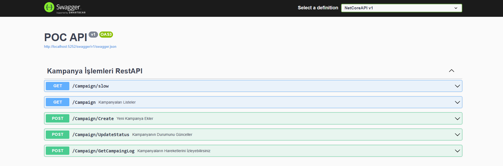

# Sigorta Kampanya API (POC)

Bu proje, sigorta sektörüne yönelik kampanyaların yönetilebildiği **POC (Proof of Concept)** amaçlı bir **ASP.NET Core Web API** uygulamasıdır.

Kullanıcıların kampanya oluşturabildiği, kampanyalarını yayınlayabildiği veya yayından kaldırabildiği ve kampanyalara ait belirli iş kurallarının uygulandığı bir API geliştirilmiştir.  
POC Demo sonrasında genişletilebilir ve üzerine yeni geliştirmeler inşa edilebilir şekilde tasarlanmıştır.

---

## 🎯 Proje Amacı

- Sigorta kampanyalarının merkezi bir API üzerinden yönetilmesi
- Kampanya yaşam döngüsünün iş kuralları ile kontrol edilmesi
- İleride geliştirilebilir bir mimari ile POC seviyesinde bir temel oluşturulması

---

## 🧱 Kullanılan Teknolojiler

- ASP.NET Core Web API
- .NET 8
- Docker
- Git
- GitHub

---

## 📌 Kampanya Bilgileri

Bir kampanya oluşturulurken aşağıdaki bilgiler alınmaktadır:

### Kampanya İlan Başlığı
- Harf (Türkçe karakterler dahil) veya rakam ile başlamalıdır
- Minimum **10**, maksimum **50** karakter
- Aynı kategori, başlık ve açıklamaya sahip ilanlar **mükerrer** kabul edilir

### Kampanya Detay Açıklaması
- Minimum **20**, maksimum **200** karakter
- Özel karakterler kullanılabilir

### Kampanya Kategorisi
Aşağıdaki sabit kategorilerden biri seçilebilir:
- Tamamlayıcı Sağlık Sigortası (TSS)
- Özel Sağlık Sigortası (ÖSS)
- Hayat Sigortası
- Diğer

> Yeni kategori eklenmeyeceği varsayılmıştır.

---

## 🔄 Kampanya Yaşam Döngüsü

Kampanyalar aşağıdaki durumlarda bulunabilir:

- **Onay Bekliyor**
- **Aktif**
- **Deaktif**
- **Mükerrer**

### İş Kuralları

- Kampanya ilk oluşturulduğunda:
  - **Hayat Sigortası** → `Aktif`
  - **TSS, ÖSS, Diğer** → `Onay Bekliyor`
- Aynı kategori, başlık ve açıklamaya sahip kampanyalar **Mükerrer** olarak işaretlenir
- Mükerrer kampanyaların durumu güncellenemez
- `Onay Bekliyor` durumundaki kampanyalar onaylandığında `Aktif` olur
- Kullanıcı:
  - `Aktif` veya `Onay Bekliyor` durumundaki kampanyayı `Deaktif` yapabilir
- `Deaktif` edilen kampanyanın tekrar `Aktif` edilmesi POC kapsamında **desteklenmemektedir**

---

## ⚙️ Varsayımlar

- POC kapsamında kampanya giren ve onaylayan kullanıcıların aynı olduğu varsayılmıştır
- Kimlik doğrulama (auth) mekanizması varmış gibi düşünülmüştür
- Kampanya için sadece **durum değişikliği** yapılabilir
- Başlık, açıklama ve kategori güncellenmesi desteklenmemektedir

---

## 📡 API Kapsamı

### Temel İşlevler
- Sigorta kampanyası oluşturma
- Kampanya aktivasyon / deaktivasyon işlemleri
- Kampanya durum güncellemeleri

### İstatistik (Dashboard)
Kayıtlı kampanyaların durum bazlı istatistikleri:

## 📸 API Swagger Görünümü

